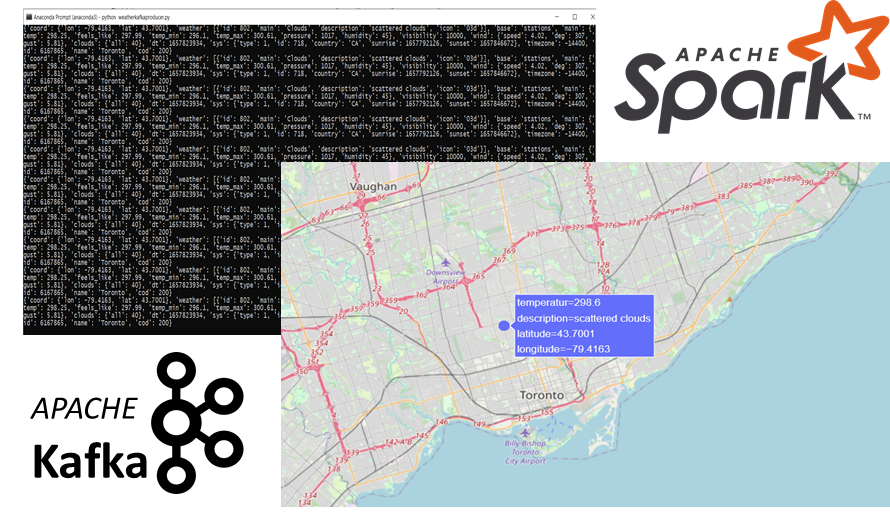

# Real-Time End-to-End Streaming with Kafka and Spark
A real-time end-to-end weather data streaming pipeline in integration with Kafka and Spark Streaming for the City of Toronto. 

Pandas and Plotly library are used for the analysis and visualization of weather data.

## Start the Kafka environment in windows
Start Apache Zookeeper. Open a terminal:
```
zookeeper-server-start.bat C:\kafka\config\zookeeper.properties

```
Start the Kafka server. Open another terminal:
```
kafka-server-start.bat C:\kafka\config\server.properties

```
Create a topic to store your events. Open another terminal:
```
kafka-topics.bat --create --zookeeper localhost:2181 --replication-factor 1 --partitions 1 --topic WeatherTopic

```
Run the console producer . Open another terminal, navigate to the project folder:
```
python weatherkafkaproducer.py

```
Run the console consumer client/ submit your spark job . Open another terminal, navigate to the project folder:
```
spark-submit --packages org.apache.spark:spark-streaming-kafka-0-8_2.11:2.3.0  weatherkafkaspark.py

```
## Spark UI

The web interface of a running Spark application to monitor and inspect Spark job executions in a web browser.
```
http://host.docker.internal:4040/jobs/

```



